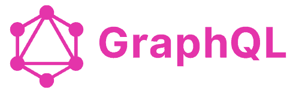

## Description

This uses the nodeJs Axios library to query a subgraph with graphQL query.

Response:
```[
  {
    id: '0x21b8065d10f73ee2e260e5b47d3344d3ced7596e',
    token0: {
      id: '0x66a0f676479cee1d7373f3dc2e2952778bff5bd6',
      symbol: 'WISE'
    },
    token1: {
      id: '0xc02aaa39b223fe8d0a0e5c4f27ead9083c756cc2',
      symbol: 'WETH'
    },
    reserveUSD: '263306541.5982228483732744018602897',
    volumeUSD: '712506527.887432114455060390231566'
  }
  (..first 10 entries...)
```
There are two categories that subgraphs fall in: hosted/centralized or decentralized. This subgraph is hosted by 
theGraph which is why it does not require an API key. Contrary to other subgraphs on the network they will require an API key
that is linked to your wallet and has GRT to sustain the cost of each query.

If a dApp is using GRT they likely have a reserve wallet containing GRT coins to pay for the cost of each query from their users. 
In theory, it is possible to require the users to pay for data retrieval costs on a dApp however, this has obvious usability and inefficiency
concerns. 

In normal HTTP GET requests there are DDOS attacks.  HTTP POST requests are susceptible to smuggling attacks where an attacker can modify 
the data being sent to the server and (in some cases) changing the response they get back. I am curious how theGraph shields itself from these 
attacks.

## Checkpoint🏁
My next goal is to create & deploy my own subgraph.